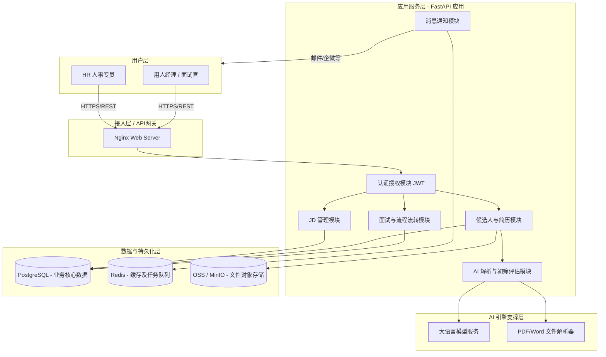

# AI 招聘平台 - 技术架构与核心设计方案

## 1. 整体技术架构设计

为确保第一期项目（简历解析、自动化通知、AI初筛、流程简化）能够快速落地，同时具备良好的扩展性以支撑未来需求，采用 **前后端分离的现代化单体微服务架构 (Modular Monolith)**。

### 1.1 技术栈选型
- **前端 (Frontend)**: `Vue 3` / `React` + `TypeScript` + `Tailwind CSS`，考虑到后台管理和 HR 交互的复杂的表单和看板，推荐使用 `Ant Design` 或 `Element Plus` 构建中台系统。
- **后端 (Backend)**: `Python 3.10+` + `FastAPI` (Python 天然契合 AI 和 NLP 相关处理，如 LangChain 接入、简历 OCR 解析等，FastAPI 提供极高的高性能异步接口)。
- **数据库 (Database)**: `PostgreSQL 14+`，强大且支持复杂的 JSONB 查询及全文检索，适合存储简历等非结构化/半结构化数据。
- **缓存与消息队列 (Cache & MQ)**: `Redis`（用于 Token 管理，以及基于 `Celery` / `RQ` 的异步任务队列，如简历异步大模型解析、邮件/企微自动化通知下发）。
- **AI 引擎层**: 接入主流 LLM (如 智谱GLM / 阿里通义千问 / 深度求索 DeepSeek，或 OpenAI 接口规范模型)，结合提示词工程进行简历结构化提取和 JD 匹配评估。
- **存储服务 (Storage)**: `MinIO` 或 云厂商 OSS (阿里云 OSS / 腾讯云 COS)，用于存储原始简历附件 (PDF/Word/图片)。

### 1.2 系统逻辑架构图



---

## 2. 核心 API 设计规范

统一定义后端接口的响应格式、鉴权方式及 URL 命名规范，方便前后端（小柴和小程）高效对接。

### 2.1 基础规范
- **协议**: HTTPS
- **数据格式**: JSON (`application/json`)
- **API 风格**: RESTful URL (如：`GET /api/v1/candidates`, `POST /api/v1/jobs`)
- **鉴权方式**: HTTP Header 携带 `Authorization: Bearer <JWT_TOKEN>`

### 2.2 统一响应数据结构

```json
{
  "code": 200,             // 业务状态码 (200=成功，400=请求错误，401=未授权，500=内部错误)
  "message": "success",    // 面向用户的友好提示信息
  "data": { ... }          // 业务数据负载，失败时为空或 null
}
```

分页查询数据响应标准格式：
```json
{
  "code": 200,
  "message": "success",
  "data": {
    "items": [ {...}, {...} ], // 当前页数据列表
    "total": 128,              // 总记录数
    "page": 1,                 // 当前页码
    "size": 20                 // 每页条数
  }
}
```

### 2.3 核心业务接口契约大纲 (V1版)

**A. 职位 (JD) 管理**
- `POST /api/v1/jobs` - 创建新岗位需求
- `GET  /api/v1/jobs` - 获取管理的职位列表
- `GET  /api/v1/jobs/{id}` - 获取特定职位详情
- `PUT  /api/v1/jobs/{id}` - 更新职位信息 (如关闭招聘)

**B. 简历与候选人自动化流转**
- `POST /api/v1/candidates/upload` - (HR) 上传简历附件，返回任务ID并触发异步 AI 解析流程
- `GET  /api/v1/candidates/upload-status/{task_id}` - 轮询或 Websocket 监听解析进度
- `GET  /api/v1/candidates` - 浏览候选人公海或指定特定职位的已投递人员
- `GET  /api/v1/candidates/{id}` - 查看候选人深度详情及结构化履历
- `GET  /api/v1/applications/{application_id}/ai-evaluation` - 查看 AI 针对此 JD 给该候选人生成的初筛测评报告

**C. 面试安排与协作**
- `POST /api/v1/interviews` - 安排面试 (自动触发系统和邮件通知给用人经理及候选人)
- `PUT  /api/v1/interviews/{id}/status` - 用人经理更新面试结果/面评反馈

---

## 3. 数据库表结构初步设计方案 (PostgreSQL)

以下为支持一期核心业务逻辑的实体关系模型 (ER) 设计：

### 3.1 核心表设计

#### 1. `sys_user` 账号与用户表
*(收口统一管理 HR 及 用人经理角色的登录与联系机制)*
- `id` (UUID, PK)
- `username` (VARCHAR, 唯一登录ID)
- `password_hash` (VARCHAR, 盐值加密密码)
- `real_name` (VARCHAR, 姓名显示)
- `role` (VARCHAR, 角色枚举：'HR', 'HIRING_MANAGER', 'ADMIN')
- `email` (VARCHAR, 用于接收提醒的邮箱)
- `created_at`, `updated_at` (TIMESTAMP)

#### 2. `biz_job` 职位/需求表 (JD)
- `id` (UUID, PK)
- `title` (VARCHAR, 需求岗位名称)
- `department` (VARCHAR, 部门)
- `requirements` (TEXT, 核心胜任力要求 - AI 用于比对打分的重要参照字段)
- `responsibilities` (TEXT, 从事工作职责)
- `status` (VARCHAR, 岗位状态：'OPEN', 'CLOSED')
- `hiring_manager_id` (FK -> `sys_user.id`, 归属用人经理)
- `created_by` (FK -> `sys_user.id`, 发布 HR)
- `created_at`, `updated_at`

#### 3. `biz_candidate` 候选人公池表 (标准化数据)
*(存储经由 AI 从 PDF/Word 等原始简历中萃取并清洗好的结构化特征体系)*
- `id` (UUID, PK)
- `name` (VARCHAR, 候选人姓名)
- `email` / `phone` (VARCHAR, 隐私脱敏后的联系特征)
- `education_level` (VARCHAR, 最高学历：本科、硕士等)
- `years_of_experience` (INT, 累计工作年限)
- `skills` (JSONB / TEXT[], 匹配度高的技能标签雷达)
- `resume_file_url` (VARCHAR, 原始简历在 OSS/MinIO 中的访问挂载路径)
- `raw_parsed_data` (JSONB, AI大模型结构化提取的全量详细JSON履历包，供前端动态绘制时空轮廓)
- `created_at`, `updated_at`

#### 4. `biz_job_application` 投递/(职位-候选人)生命周期表 
*(系统核心主线记录，管理从筛查到 Offer 的全链路及 AI 决策支撑)*
- `id` (UUID, PK)
- `job_id` (FK -> `biz_job.id`)
- `candidate_id` (FK -> `biz_candidate.id`)
- `status` (VARCHAR, 生命周期状态栅栏：'NEW'(新简历池), 'AI_SCREENED'(AI初筛就绪), 'INTERVIEW_PENDING'(待安排面试), 'INTERVIEWING'(面试流转中), 'OFFERED'(Offer阶段), 'REJECTED'(已淘汰库))
- `ai_score` (INT, AI给出的匹配度综合评分 0-100)
- `ai_evaluation_summary` (TEXT, AI 根据 JD 生成的初筛“小作文”：推荐亮点与潜在风险总结)
- `created_at`, `updated_at`

#### 5. `biz_interview` 面试行程跟进表
- `id` (UUID, PK)
- `application_id` (FK -> `biz_job_application.id`)
- `interviewer_id` (FK -> `sys_user.id`, 对应的面试官/用人经理)
- `scheduled_time` (TIMESTAMP, 预定的面试时刻)
- `location_or_link` (VARCHAR, 线下会议室信息或腾讯会议/Zoom 链接)
- `status` (VARCHAR, 进度枚举：'SCHEDULED'(已预定), 'COMPLETED'(已完成面谈), 'CANCELED'(已取消))
- `feedback_score` (INT, 面试官人工回填综合能力打分 1-5分制)
- `feedback_content` (TEXT, 结构化面试评语短文)
- `created_at`, `updated_at`

---
> **架构师寄语**：
> 针对当前业务规模及一期上线诉求，此套架构在设计中刻意侧重于“**核心业务主流程闭环的高效落地**”与“**AI 大模型的工程化稳定接入**”。因此在后端选用 FastAPI 可以极其舒适地串联 Python AI 开源生态优势，同时在存储选型上用 PG 的 `JSONB` 能力应对变化快速、缺乏标准图谱的原始简历信息片段结构。
>
> 整体输出完毕，接下来请【开发端】**小程**重点投入后端项目结构搭建与 DB 初始化设计检查；请**小柴**同步使用对应的框架开启前端骨架构建与基础路由对接。架构后续将随着二期需求进一步实施演进设计！
